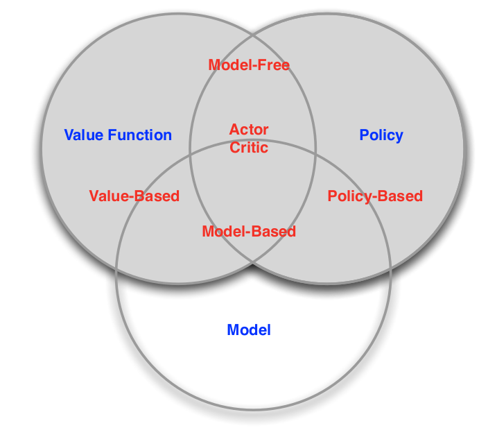
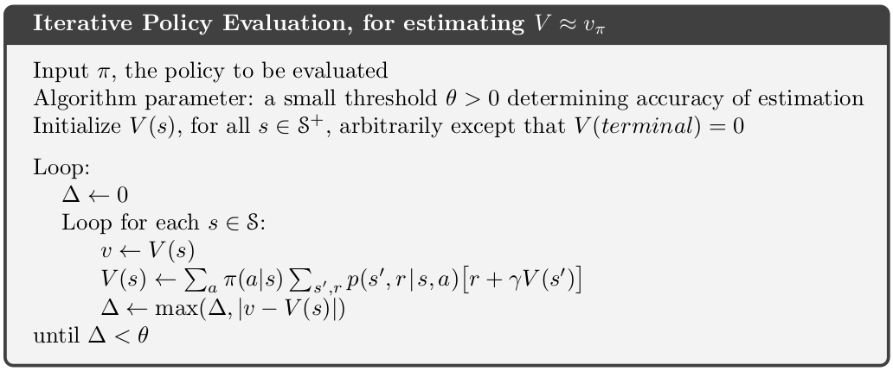
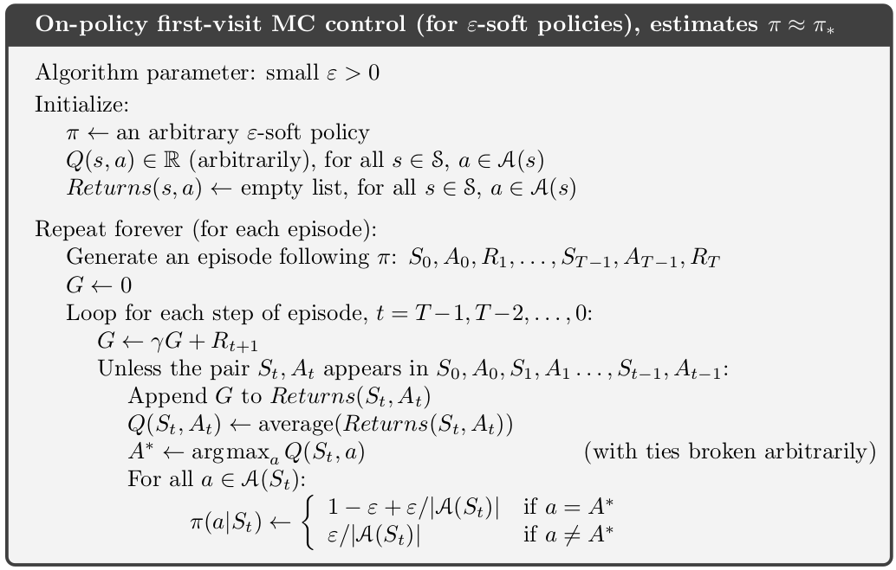
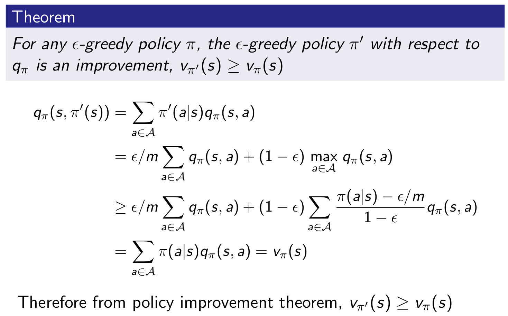
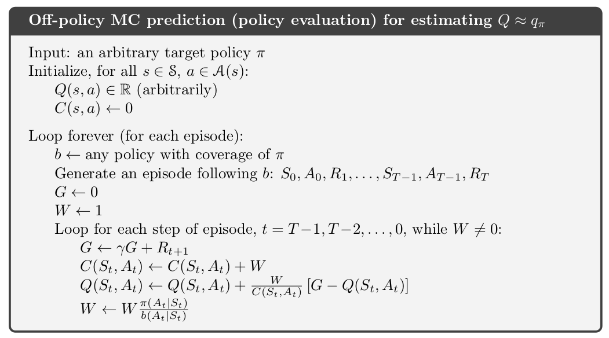
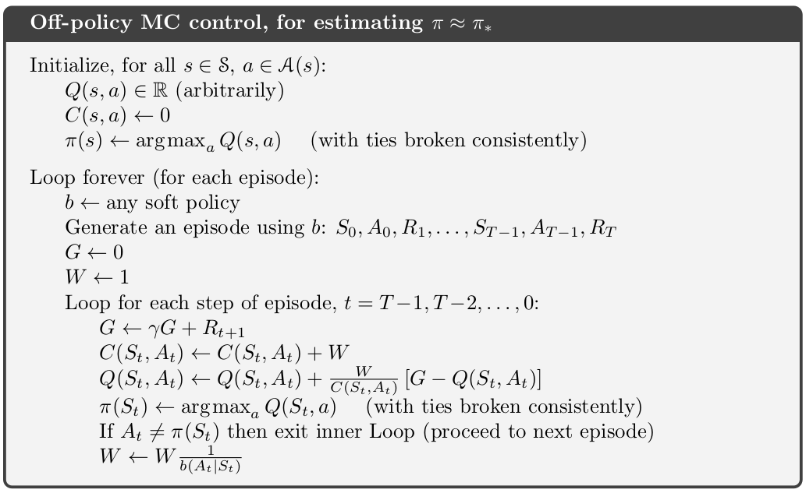

## Reinforcement Learning
[deep rl tutorial in icml 2016](https://icml.cc/2016/tutorials/deep_rl_tutorial.pdf)

相比与监督学习，强化学习没有训练数据的输出值，但是有奖励值； 相比与无监督学习，除了训练数据还有奖励规则。

- env: environment
- agent: intelligent robot

强化学习八要素：

1. S: state
2. A: action
3. R: reward，个体在$S_t$采取动作$A_t$对应的奖励为$R_{t+1}$
4. $\pi$: policy,策略，即在某一状态下如何选择动作，常以条件概率表示为$\pi(a/s)=P(A_t=a|S_t=s)$，即在状态s时采取动作a的概率
5. v: value, 在策略$\pi$和状态s下，进入下一个状态后的价值，又被称为值函数，表示为$v_\pi(s)$. 事实上值函数代表当前状态的价值，而是否能达到目的还跟未来的状态有关，故当前值函数也跟未来状态的值函数有关:
$$v_\pi(s)=\mathbf{E}_\pi(R_{t+1}+\gamma R_{t+2}+\cdots| S_t=s)$$
6. $\gamma$: discount rate(reward decay rate), 如果为0，则是贪婪法，即价值只由当前延时奖励决定，如果是1，则所有的后续状态奖励和当前奖励一视同仁。大多数时候，我们会取一个0到1之间的数字，即当前延时奖励的权重比后续奖励的权重大
7. $P^a_{ss'}$: state transition model，在当前状态s采取动作a后转到下一个状态s‘的概率，虽然大部分问题的的状态转化模型为1. P predicts the next state, R predicts the next reward.
$$P^a_{ss'}=P[S_{t+1}=s'|S_t=s,A_t=a] \\
R^a_s=E[R_{t+1}|S_t=s,A_t=a]$$
8. $\epsilon$: exploration rate

approaches to reinforcement learning: Using deep networks to represent value, policy, model

- categorizing 1
    - valued-based
    - policy-based
    - actor critic
        - policy
        - value function
- categorizing 2
    - model free
        - policy and/or value function
    - model based
        - policy and/or value function
        - model

**prediction and control**

- prediction: evaluate the future
    - given a policy
- control: optimise the future
    - find the best policy

- 预测：给定强化学习的6个要素：状态集S, 动作集A, 模型状态转化概率矩阵P, 即时奖励$r$，衰减因子$\gamma$,  给定策略$\pi$， 求解该策略的状态价值函数$v(\pi)$
- 控制：求解最优的价值函数和策略。给定强化学习的5个要素：状态集S, 动作集A, 模型状态转化概率矩阵P, 即时奖励r，衰减因子$\gamma$, 求解最优的状态价值函数$v_*$和最优策略$\pi_*$

**helpful equation**

- 条件边缘概率：$\rho(Z|X)=\sum_Y\rho(Z|X,Y)\rho(Y|X)$
- 条件期望：$E[g(Z)|X]=\sum_Zg(Z)\rho(Z|X)$

## Markov Decision Process

The agent’s goal is to maximize the cumulative reward:
$$G_t=R_{t+1}+R_{t+2}+\cdots+R_T,\\ \text{T is the terminal step}$$
Discounting reward for a continuous episode:
$$G_t=R_{t+1}+\gamma R_{t+2}+\cdots=\sum_{k=0}^\infty \gamma^kR_{t+k+1}$$
If $0<\gamma< 1$, the sum will be finite as $R_{t}$ is bounded. $\gamma+\gamma^2+\cdots+\infty=\frac{1}{1-\gamma}$

- 状态转化模型：$P_{ss'}^a=E(S_{t+1}=s'|S_t=s,A_t=a)$
- policy：$\pi(a/s)=P(A_t=a|S_t=s)$
- state-value function under policy $\pi$：$v_\pi(s)=E(G_t|S_t=s)=E_\pi(R_{t+1}+\gamma R_{t+2}+\cdots| S_t=s)$
- action-value function for policy $\pi$：$q_\pi(s,a)=E(G_t|S_t=s,A_t=a)=E_\pi(R_{t+1}+\gamma R_{t+2}+\cdots| S_t=s,A_t=a)$

价值函数表示该状态下的价值，而动作价值函数是在该状态下可能的各个动作的价值，价值函数是由这些动作价值函数的期望共同构成的。

递推关系:

$$v_\pi(s)=\sum_{a\in A}\pi(a/s)q_\pi(s,a)\\
q_\pi(s,a)=R_{t+1}+\gamma\sum_{s'\in S}P_{ss'}^av_\pi(s')\\
v_\pi(s)=\sum_{a\in A}\pi(a/s)(R_{t+1}+\gamma\sum_{s'\in S}P_{ss'}^av_\pi(s'))\\
q_\pi(s,a)=R_{t+1}+\gamma\sum_{s'\in S}P_{ss'}^a\sum_{a\in A}\pi(a'/s')q_\pi(s',a')$$

最优价值函数：
在局部最优的策略下，状态价值函数应局部最大，动作价值函数应局部最大。

$$v_*(s)=\max_{\pi}v_\pi(s)\\
q_*(s,a)=\max_{\pi}q_\pi(s,a)\\
\pi_*(a/s)=
\begin{cases}
0& \text{if } a=\arg \max_{a\in A}q_*(s,a)\\
1& \text{else}
\end{cases}$$

因此值函数便不再是各个值函数的期望，而直接选择最大的值函数。
$$v_*\pi*(s)=\max_a(R_{t+1}+\gamma\sum_{s'\in S}P_{ss'}^av_*(s'))\\
q_*(s,a)=R_{t+1}+\gamma\sum_{s'\in S}P_{ss'}^a\max_{a'}q_*(s',a')$$

**ergodic Markov process**

## Dynamic Programming

Dynamic programming is a method for solving complex problems by breaking them down into subproblems and MDP just satisfy the property.
- for prediction
    - input: MDP$<S,A,P,R,\gamma>$ and policy $\pi$
    - output: value function $v_\pi$
- for control
    - input: MDP$<S,A,P,R,\gamma>$
    - output: optimal value function $v_*$ and optimal policy $\pi_*$

$$\begin{align}v_\pi(s)&=\sum_{a\in A}\pi(a/s)(r+\gamma\sum_{s'\in S}P_{ss'}^av_\pi(s')) \\
&=\sum_{a\in A}\pi(a/s)\sum_{s'\in S}P_{ss'}^a(r+\gamma v_\pi(s')) \\
&=\sum_{a\in A}\pi(a/s)\sum_{s',r}p(s',r|s,a)(r+\gamma v_\pi(s'))
\end{align}$$

1. iterative policy evaluation: prediction

策略已知，通过值函数迭代公式使值函数收敛（$\Delta v=0$）。

2. policy iteration/Policy improvement

improve the policy by acting greedily:
$$\pi^*(s)=arg\max_{a\in A}q_\pi(s,a)\\
q_\pi(s,\pi^*(s))=\max_{a\in A}q_\pi(s,a)=v_{\pi^*}(s)\geq q_\pi(s,a)=v_\pi(s)$$
when the iteration stop:
$$q_\pi(s,\pi^*(s))=v_{\pi^*}(s)=v_\pi(s)$$
the optimal value funtion and optimal policy are found.

在值函数未知及策略未知的情况下（由于最优策略可完全由最有值函数得出，故值函数未知，则最优策略未知），通过值函数迭代公式使值函数收敛（$\Delta v=0$），收敛后的值函数便是所求的值函数，因此最优策略也可因此而得出。这里的值函数迭代由于没有策略函数，故采用最优值函数迭代公式，即策略是选择局部最大值函数进行迭代。

3. value iteration

对于预测问题，相当策略已知，通过贝尔曼方程迭代可以求得。而对于控制问题，需要不断更新Q表使其收敛，则最优策略也即得出（最有策略依据最大值函数）。策略迭代：根据探索率更新策略。价值迭代：探索率接近0时，依据值函数更新。

**asynchronous dynamic programming**
- in-place dtnamic programming

not(two copies of value function): $v_{new}(s)\leftarrow\max{a}(R^a_s+\gamma\sum_{s'\in S}P^a_{ss'}v_{old}(s'))$  
but(one copy of value function): $v(s)\leftarrow\max{a}(R^a_s+\gamma\sum_{s'\in S}P^a_{ss'}v(s'))$  

- prioritisedd sweeping: use the magnitude of Bellman error to guide state selection
$$|\max_{a}(R^a_s+\gamma\sum_{s'\in S}P^a_{ss'}v(s'))-v(s)|$$

- real-time dynamic programming

## Monte Carlo Methods

We do not assume complete knowledge of the environment. To sample some complete episodes. 

不基于模型的强化学习问题，即状态转化概率未知。

- prediction:
$$G_t=R_{t+1}+\gamma R_{t+2}+\cdots \\
v_\pi(s)\approx average(G_t)$$

    - If one state appears many times in one episode:**first visit**- only consider the first show-up value; **every visit**- calculate the average
    - incremental mean: $\mu_k=\frac{1}{k}\sum^k_{j=1}=\mu_{k-1}+\frac{1}{k}(x_k-\mu_{k-1})$
- control: update every step
    - greedy policy improvement over $v(s)$ requires model of MDP
        $$\pi'(s)=arg\max_{a\in A}R^a_s+P^a_{ss'}v(s')$$
    - greedy policy improvement over $q(s,a)$ is model-free
        $$\pi'(s)=arg\max_{a\in A} q(s,a)$$
    - $\epsilon$ greedy:most of the time they choose an action that has maximal estimated action value, but with probability $\epsilon$ they instead select an action at random. $m=|A(t)|$ is the number of action space dim.
        $$ \pi(a|s)=\left\{
        \begin{aligned}
        = & \epsilon/m+1-\epsilon \quad \text{if } a^*=arg\max Q(s,a) \\
        = & \epsilon/m \text{ else}
        \end{aligned}
        \right.
        $$

**off policy**

- on policy:生成样本的policy（value function）跟网络更新参数时使用的policy（value function）相同. 可能会陷入局部最优。
- off policy: 生成样本的policy（value function）跟网络更新参数时使用的policy（value function）不同. Evaluate target policy $\pi(a|s)$ to compute $v_\pi(s)$ or $q_\pi(s,a)$ while following behaviour policy $\mu(a|s)$: $\{S_1,A_1,R_1,\cdots,S_T\}\sim\mu$

[importance sampling](http://blog.sciencenet.cn/blog-3189881-1126246.html): 用一个简单分布去估计服从另一个分布的随机变量的均值

$$\begin{align}E_{X\sim P}[f(x)]&=\sum P(X)f(X) \\
                                &=\sum Q(X) \frac{P(X)}{Q(X)}f(X)   \\
                                &=E_{X\sim Q} \frac{P(X)}{Q(X)}f(X)
\end{align}$$

Use returns generated from $\mu$ to evaluate $\pi$ with weight return $G_t$ according to similarity between policies:

$$G_t^{\pi/\mu}=\frac{\pi(A_t|S_t)\pi(A_{t+1}|S_{t+1})\cdots \pi(A_T|S_T)}{\mu(A_t|S_t)\mu(A_{t+1}|S_{t+1})\cdots \mu(A_T|S_T)} G_t$$
Update value towards corrected return:
$$V(S_t)\leftarrow V(S_t)+\alpha(G_t^{\pi/\mu}-V(S_t))$$

Incremental Implementation

## Temporal-Difference Learning

learns from incomplete episode

$$G(t)=R_{t+1}+V(S_{t+1})$$
iteration, $\alpha\in [0,1]$:
$$V(S_t)=V(S_t)+\alpha(G(t)-V(S_t)) \\
Q(S_t,A_t)=Q(S_t,A_t)+\alpha(G(t)-Q(S_t,A_t))$$

**TD($\lambda$)**

$$G^\lambda(t)=(1-\lambda)\sum^\infty_{n=1}\lambda^{n-1}G_t^{(n)}$$
$$V(S_t)=V(S_t)+\alpha(G^\lambda(t)-V(S_t)) \\
Q(S_t,A_t)=Q(S_t,A_t)+\alpha(G^\lambda(t)-Q(S_t,A_t))$$

**on policy: SARSA**

$$Q(S,A)=Q(S,A)+\alpha(R+\gamma Q(S',A')-Q(S,A))$$

**off policy: Q learning**

$$Q(S,A)=Q(S,A)+\alpha(R+\gamma \max_{a}Q(S',A)-Q(S,A))$$

